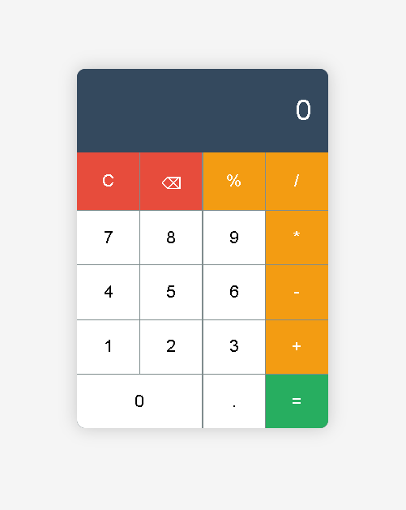

# 🧮 Basic Calculator Web App

A simple, interactive calculator built using **HTML**, **CSS**, and **JavaScript**. This app allows users to perform basic arithmetic operations like addition, subtraction, multiplication, division, and percentage calculations. It includes both **button click** and **keyboard** input support.

 🚀 Features

- Responsive and clean UI
- Real-time display updates
- Supports:
  - Addition, Subtraction, Multiplication, Division
  - Decimal input
  - Percentage calculation
  - Clear (C) and Backspace (⌫) operations
- Keyboard input support
- Visual hover feedback for all buttons

 🛠️ Tech Stack

- **HTML5** – Markup structure
- **CSS3** – Styling and layout
- **Vanilla JavaScript** – Logic and interactivity

 📁 File Structure

calculator-project/
│
├── index.html # Main HTML file
├── styles.css # Calculator styling
├── script.js # Calculator logic and interactivity
└── README.md # Project documentation

 💡 How to Use

1. **Clone the repository** or **download the files**.
2. Open `index.html` in your web browser.
3. Start clicking the buttons or use your keyboard to perform calculations.

 ⌨️ Keyboard Support

| Key        | Function               |
|||
| 0-9        | Number input           |
| .          | Decimal point          |
| +, -, *, / | Arithmetic operations  |
| %          | Percentage             |
| Enter or = | Calculate result       |
| Escape     | Clear all (C)          |
| Backspace  | Delete last digit (⌫) |

 🖼️ Preview

 📌 To-Do / Improvements

- Add support for parentheses and advanced expressions
- Add history panel for previous calculations
- Responsive layout for smaller screens (mobile-first)

 📄 License

This project is open-source and available under the [MIT License](LICENSE).

 🙌 Acknowledgments

This project was built as a practice exercise to improve proficiency in front-end development.
